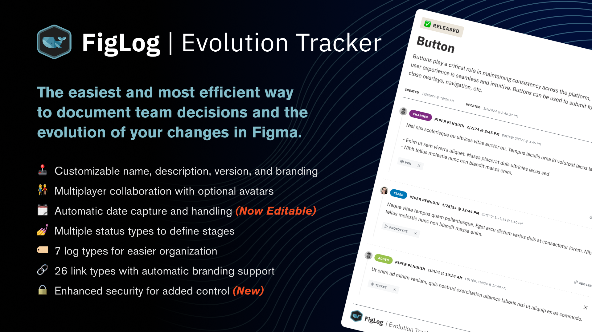

  
  

  <h3>
    Design Evolution Widget for Figma
  </h3>

  
  

   
   

# FigLog

**FigLog is the easiest and most efficient way to document team decisions and the evolution of your changes in Figma.**

## Contents

- [Overview](#overview)
- [Features](#features)
- [Usage](#usage)
- [Contributing](#contributing)
- [Maintenance Status](#maintenance-status)

## Overview

The FigLog widget works with both Figma and FigJam files and can be used solo or with a team. Simply drag a new FigLog widget to the canvas and get started customizing and adding your updates. New changelogs can be added by any user that has edit access to the file the widget is used in.

We hope FigLog becomes a useful tool for you as a way of documenting the evolution of your work and the decisions and context around those updates.

## Features

- Optional component status, name, description, version, log types, and branding 🕹️
- Multiplayer collaboration with user name and avatar 👫
- Automatic date handling (including log edits) 🗓️
- 6 status types 💅
- 7 changelog types 🐙 **(New!)**
- 17 link types 🔗 **(New!)**

## Usage

Please see the [FigLog Community Page](https://www.figma.com/community/widget/1293230657540297914).

## Contributing

Please see the [Contributing guide](CONTRIBUTING.md).

[Icons](https://lucide.dev/icons/) from [Lucide](https://lucide.dev/).

## Maintenance Status

**Active:** Formidable is actively supporting this open source project, and we expect to continue collaborating on it for the foreseeable future. Bug reports, feature requests and pull requests are greatly appreciated and welcome.
